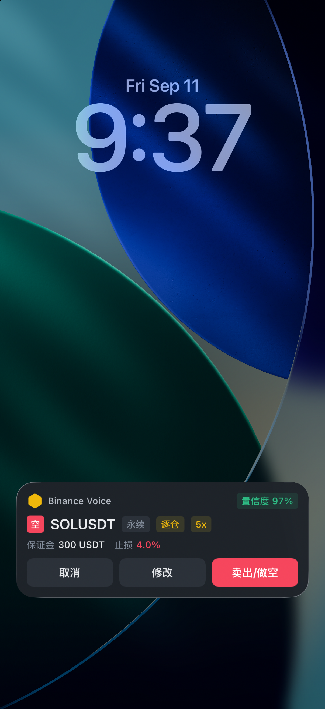
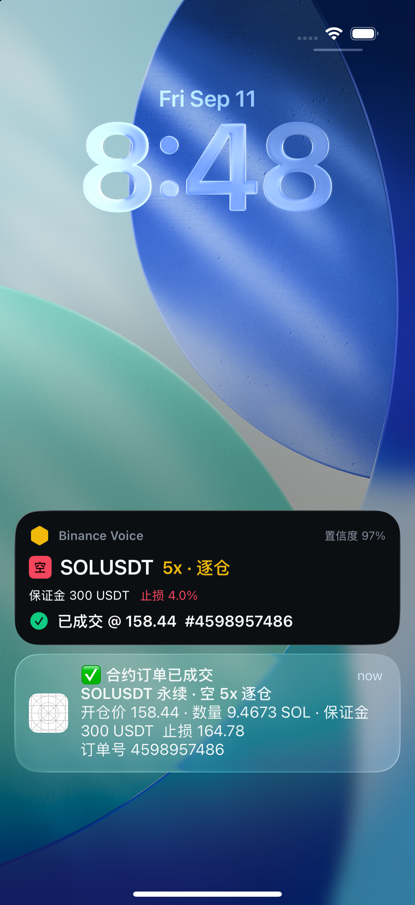
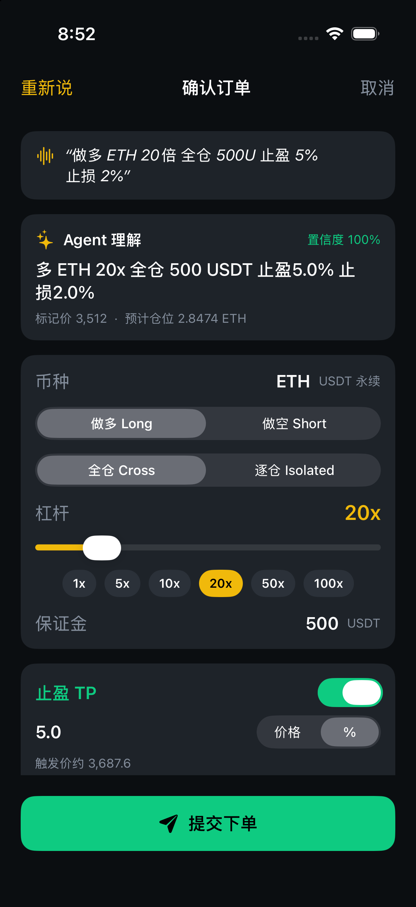
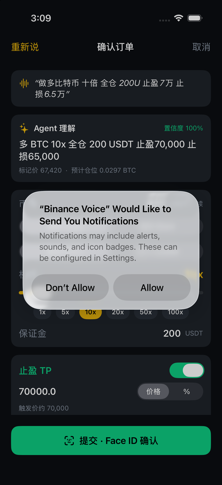

# Binance Voice Agent (Hackathon)

SwiftUI 原生 iOS App:**Action Button → 语音听写 → Agent 结构化解析 → 灵动岛/锁屏卡片确认 → 下单 → 原生通知**。全程不需要打开 App。

| 灵动岛卡片(待确认) | 灵动岛卡片(已成交 + 通知) | 「编辑」跳回 App | App 内确认页 |
|---|---|---|---|
|  |  |  |  |

## 两条语音路径(均不打开 App)

| 路径 | 语音识别 | 触发 | Intent | 结果 |
|---|---|---|---|---|
| **全局语音** | Apple 内置听写 | 快捷指令「听写文本」→ 全局语音下单 | `VoiceTradeIntent` | 灵动岛卡片:取消 / 编辑 / 确定 |
| **增强语音** | App 内置 Qwen ASR(Key 预置) | 直接绑定「增强语音」,一键录音 | `EnhancedVoiceTradeIntent` | 灵动岛卡片:取消 / 编辑 / 确定 |

### 灵动岛卡片(两条路径共用)
卡片显示 **币种 / 方向 / 杠杆 / 全仓逐仓 / 保证金 / 止盈止损 / 置信度**,底部三个按钮:
- **取消**:`CancelFromIslandIntent`,原地结束(录音/转写阶段也可取消)。
- **编辑**:深链 `binancevoice://edit`,跳进 App,刚解析的全部字段已回填到 `ConfirmView` 供快速修改。
- **确定**:`SubmitFromIslandIntent`(`LiveActivityIntent`,后台执行,不弹窗)→ App 立刻推送通知:**「合约订单已成交」** 或 **「下单失败:可用保证金不足」**(模拟可用保证金 1,000 USDT,超过即失败)等。
- 开启 Face ID 开关时,「确定」改为深链 `binancevoice://submit`,进 App 先过 Face ID 再提交。

### 全局语音(Apple 听写)
在任何 App(Coinglass / TradingView…)按下 **Action Button** → 系统「听写文本」录音 → 文本传给 `VoiceTradeIntent`(`openAppWhenRun = false`)→ 后台解析并弹出 Live Activity。

### 增强语音(内置 Qwen,一键)
`EnhancedVoiceTradeIntent` 在 **App 进程内** 执行(`openAppWhenRun = false`,App 不会切到前台;`UIBackgroundModes: audio`):
1. 灵动岛立刻显示「正在聆听」,`SpeechService` 用 `AVAudioEngine` 录 16kHz WAV,说完静音 1.6s 自动停止(最长 15s)。
2. 卡片变为「Qwen 转写中」,`DashScopeASR` 用内置 Key 上传转写(2~4 秒)。
3. `CommandParser` 解析后,卡片更新为待确认订单:取消 / 编辑 / 确定。
兼容:若快捷指令里把「录制音频」的输出接到「录音文件」参数,则跳过录音直接转写该文件。

## 真机设置

**增强语音(推荐)**:设置 → 操作按钮 → 快捷指令 → 选择「Binance Voice → 增强语音」。按下即在灵动岛开始录音,不跳 App。首次使用需先打开一次 App 授权麦克风与通知。

**全局语音**(用系统听写取音):
1. 打开「快捷指令」→ 新建。
2. 添加动作 **听写文本**(语言:中文,停止聆听:暂停后)。
3. 添加动作 **Binance Voice → 全局语音下单(Apple 听写)**,把「听写文本」的输出拖到「交易指令」参数。
4. 命名 → 设置 → 操作按钮 → 快捷指令 → 选择它。

## Face ID 开关
首页右上角齿轮 → 「Face ID 二次确认」。默认关闭:手机处于解锁状态即视为已授权,「下单」在卡片上直接后台成交。开启后每次下单都需 Face ID。

## 解析器
`CommandParser` 把自然语言解析为 `TradeOrder`:币种(支持大饼/以太坊等别名)、方向、杠杆、全仓/逐仓、保证金(中文数字、万/千、U/USDT/美元)、止盈止损(价格或百分比),并给出置信度与说明。

## 语音转写:Qwen ASR(不使用苹果语音识别)
App 内听写不走 `SFSpeechRecognizer`,而是:`AVAudioEngine` 录音 → 16kHz 单声道 WAV(说话后静音 1.6s 自动结束,最长 30s)→ 阿里云百炼 DashScope **`qwen-audio-3.0-asr-flash-filetrans`** 录音文件转写 → 文本交给 `CommandParser`。

实现见 `Services/DashScopeASR.swift`:`GET /uploads?action=getPolicy` 获取临时凭证 → multipart 上传到 OSS → `POST /services/audio/asr/transcription`(`X-DashScope-Async` + `X-DashScope-OssResourceResolve`)→ 轮询 `/tasks/{id}` → 拉取 `transcription_url` JSON 的 `transcripts[].text`。

**API Key 配置(不入库)**:
```bash
cp BinanceVoiceAgent/Config/Secrets.example.swift.template BinanceVoiceAgent/Config/Secrets.swift
# 编辑 Secrets.swift 填入 sk-…;该文件已在 .gitignore 中
```
也可在 App「设置 → 语音转写模型」里临时覆盖 Key(存 UserDefaults)。

调试:`-demoAudio /path/to.wav` 启动参数会跳过录音、直接把该文件送云端转写,用于模拟器验证整条链路。

## 工程结构
- `BinanceVoiceAgent/` App target:`AppState` 状态机、`Services/`(Speech(录音)/ DashScopeASR / Parser / Biometric / Notification / Order / IslandFlow)、`Intents/`、`Views/`、`Config/Secrets.swift`(gitignored)。
- `BinanceVoiceAgent/Shared/` App 与 Widget 共用:`TradeActivityAttributes`、`IslandIntents`、`Theme`。
- `BinanceVoiceWidget/` WidgetKit 扩展:`TradeLiveActivity`(锁屏卡片 + 灵动岛 expanded/compact/minimal)。
- `OrderService` 目前为模拟成交(接口顺序对齐 `/fapi/v1/leverage → /marginType → /order`,可直接替换真实调用)。

## 运行
```bash
brew install xcodegen
xcodegen generate
open BinanceVoiceAgent.xcodeproj   # 选真机运行(麦克风与灵动岛在真机上最完整;需先配置 Secrets.swift)
```

模拟器演示(无需真实录音):
```bash
# 云端 ASR 链路:用一段 wav 代替麦克风(say -v Tingting 生成 + afconvert 转 16k 单声道)
xcrun simctl launch booted com.hackathon.BinanceVoiceAgent -demoAudio /tmp/bnv_demo.wav
# 灵动岛流程:启动后回到桌面/锁屏即可看到卡片
xcrun simctl launch booted com.hackathon.BinanceVoiceAgent -demoTranscript "做空 SOL 5倍 逐仓 300U 止损 4%" -island
# 「修改」深链
xcrun simctl openurl booted binancevoice://edit
# App 内流程 + Face ID
xcrun simctl spawn booted notifyutil -s com.apple.BiometricKit.enrollmentChanged 1 -p com.apple.BiometricKit.enrollmentChanged
xcrun simctl launch booted com.hackathon.BinanceVoiceAgent -demoTranscript "做多比特币 十倍 全仓 200U 止盈7万 止损6.5万" -autoSubmit
xcrun simctl spawn booted notifyutil -p com.apple.BiometricKit_Sim.pearl.match
```
注:模拟器截图不包含灵动岛图层,锁屏可看到同一 Live Activity 卡片。

## 示例指令
- 做多比特币 十倍 全仓 200U 止盈7万 止损6.5万
- 做空以太坊 20倍 逐仓 500U 止盈5% 止损3%
- short DOGE 50x isolated 300 usdt tp 0.2 sl 0.14
