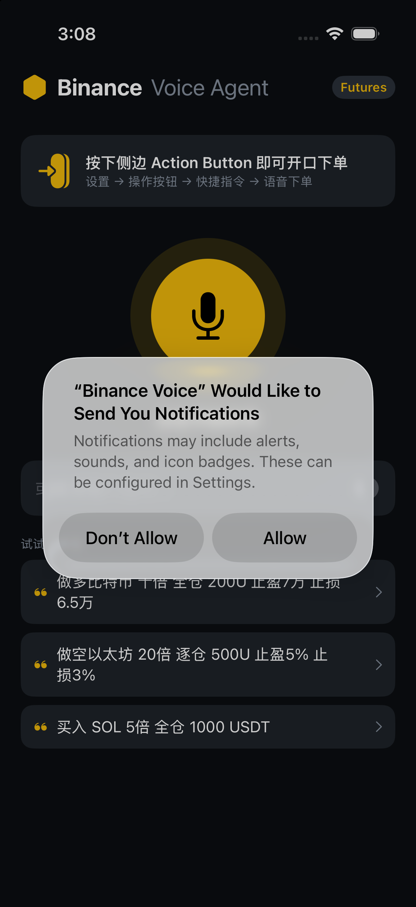
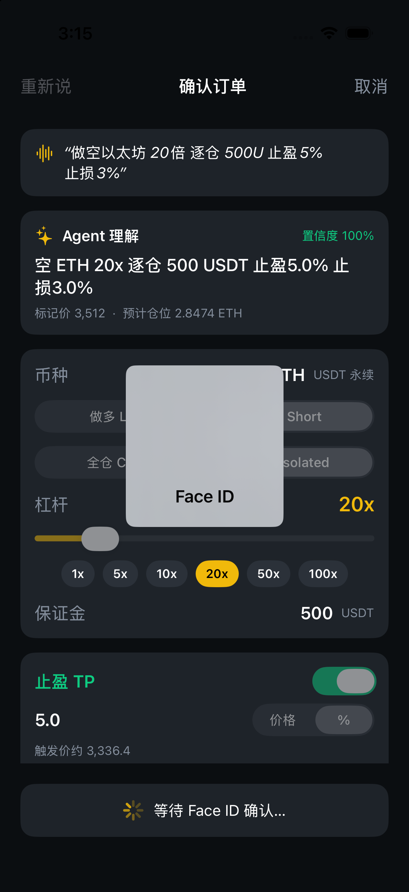
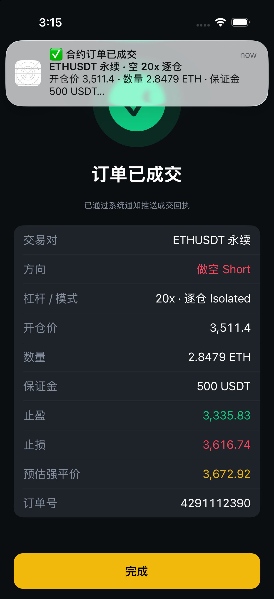

# Binance Voice Agent (Hackathon)

SwiftUI 原生 iOS App:**Action Button → 语音听写 → Agent 结构化解析 → 二次确认 → Face ID → 下单 → 原生通知**。

| 首页 | 确认 | Face ID | 成交 + 通知 |
|---|---|---|---|
|  |  |  |  |

## 流程
1. iPhone 侧边 **Action Button** 绑定快捷指令「语音下单」(`StartVoiceTradeIntent`, AppIntents),按下即打开 App 并开始听写。
2. `SpeechService` 用 `SFSpeechRecognizer`(zh-CN)实时转写,停顿 1.6s 自动结束。
3. `CommandParser` 把自然语言解析为 `TradeOrder`:**币种、方向、杠杆、全仓/逐仓、保证金、可选止盈/止损(价格或百分比)**,支持中英混说、中文数字、万/千。
4. `ConfirmView` 展示 Agent 理解 + 置信度,所有字段可二次修改。
5. 点击「提交」→ `BiometricService`(LocalAuthentication)Face ID 确认。
6. `OrderService` 模拟 Binance USDⓈ-M 合约市价开仓(接口顺序对齐 `/fapi/v1/leverage → /marginType → /order`,可直接替换真实调用)。
7. `NotificationService` 推送本地通知(前台也弹横幅,time-sensitive)。

## 运行
```bash
brew install xcodegen
xcodegen generate
open BinanceVoiceAgent.xcodeproj   # 选真机运行(语音识别在真机上最稳)
```
真机:设置 → 操作按钮 → 快捷指令 → 选择「语音下单」。

模拟器自动化演示(无需点击):
```bash
xcrun simctl spawn booted notifyutil -s com.apple.BiometricKit.enrollmentChanged 1 -p com.apple.BiometricKit.enrollmentChanged
xcrun simctl launch booted com.hackathon.BinanceVoiceAgent -demoTranscript "做多比特币 十倍 全仓 200U 止盈7万 止损6.5万" -autoSubmit
xcrun simctl spawn booted notifyutil -p com.apple.BiometricKit_Sim.pearl.match
```

## 示例指令
- 做多比特币 十倍 全仓 200U 止盈7万 止损6.5万
- 做空以太坊 20倍 逐仓 500U 止盈5% 止损3%
- short DOGE 50x isolated 300 usdt tp 0.2 sl 0.14
